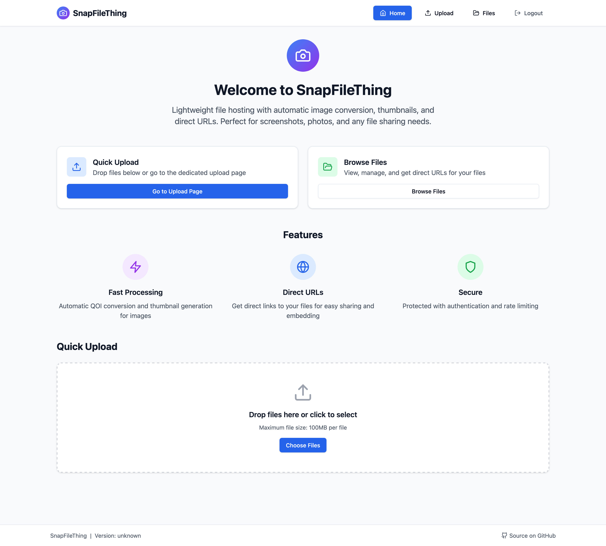
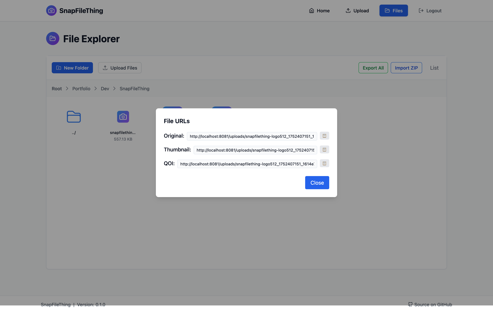

<p align="center">
  
</p>

<h1 align="center">SnapFileThing</h1>

<p align="center">
  <b>A modern, minimalist, and lightning-fast self-hosted file sharing solution.</b>
</p>

---

## 🚀 What is SnapFileThing?

SnapFileThing is a lightweight, database-less, and performant file sharing platform designed for simplicity and speed. It lets you securely upload, manage, and share files from your own server, with a beautiful and responsive interface. Whether you need direct URLs for your files, thumbnails for your assets, or a complete file explorer, SnapFileThing has you covered—without any of the bloat or restrictions of other solutions.

---

## 🏆 Why SnapFileThing?

> Inspired by [Picsur](https://github.com/CaramelFur/Picsur/tree/master) and [UploadThing](https://uploadthing.com/), but built to fit my own needs.

While exploring existing solutions to host pictures for my [Portfolio](https://ericphlpp.com), I found that paid tiers, missing UI features, and unnecessary complexity got in the way of my workflow. I needed a tool to simply host files on my own server, serve them directly (with thumbnails!), and manage everything through a modern, minimalist interface. SnapFileThing is the answer—a tool that just works, with no restrictions.

---

## ✨ Features

- **Instant File Sharing:** Upload and share files in seconds, with direct URLs for easy embedding anywhere.
- **Beautiful File Explorer:** Sleek, modern, and fully responsive interface to browse, preview, and manage your files.
- **Thumbnail Generation:** Automatic thumbnail creation for images, including QOI, JPEG, PNG, and WebP.
- **Seamless Multi-Device Experience:** Works great on desktop, tablet, and mobile.
- **Secure by Default:** Local API and admin interface are protected, with authentication and rate limiting.
- **Dual-Port Architecture:** One port for the secure API, uploads, Swagger docs, and file explorer; a second port dedicated to fast, isolated static file serving.
- **Database-less**: No database required—just run and go.
- **Written in Rust**: Blazing fast, memory-safe, and reliable.
- **Simple & Not Overly Complex**: Focused on doing one thing well.
- **Performant**: Handles large files and many requests with ease.
- **Direct URLs & Thumbnails**: Serve files directly with thumbnails, perfect for embedding across your websites.
- **Advanced Image Support**: Native [QOI (Quite OK Image)](https://qoiformat.org/) support for ultra-fast, lossless images.
- **OpenAPI/Swagger Docs**: Built-in API documentation for easy integration and automation.
- **Tiny Docker Image**: All-in-one image under 40MB for easy deployment anywhere.
- **Open Source**: MIT licensed and ready for your contributions.

---

## 🏗️ Technical Perks

- **Dual-Port Architecture**: The Rust server runs on two separate ports:
  - **Main Port**: Hosts the secure local API, file upload endpoints, Swagger documentation, and the modern file explorer interface.
  - **Static File Port**: Dedicated to serving files only, providing a clean, fast, and isolated endpoint for direct file access.
- **QOI Format Integration**: QOI files are supported natively, offering faster and smaller lossless images compared to PNG, ideal for efficient storage and transfer.
- **Security by Design**: The separation of API/UI and static file serving minimizes attack surface and allows for fine-grained access control.

---

## 📸 Screenshots

<p align="center">
  
  
</p>

---

## 🐳 Quick Start

### Run with Docker (Recommended)

```sh
# Move the .env.example file to .env and configure it
cp ./backend/.env.example /.env

docker run -d \
  -p 8080:8080 \
  -v /your/files:/data \
  ghcr.io/Eric-Philippe/snapfilething:latest
```

- Replace `/your/files` with the path where you want to store your files.
- The Docker image is under 40MB and contains everything you need.

You can also run the Docker image inside a Docker Compose setup or with custom ports and environment variables:

```yml
version: "3.8"

services:
  snapfilething:
    build:
      context: .
      dockerfile: Dockerfile
    ports:
      - "8080:8080" # Web Interface + API
      - "8081:8081" # Static files
    volumes:
      - ./uploads:/app/uploads
    environment:
      - RUST_LOG=info
    env_file:
      - backend/.env
    restart: unless-stopped
    healthcheck:
      test:
        [
          "CMD",
          "wget",
          "--no-verbose",
          "--tries=1",
          "--spider",
          "http://localhost:8080/api/health",
        ]
      interval: 30s
      timeout: 10s
      retries: 3
      start_period: 40s

volumes:
  uploads:
    driver: local
```

```sh
docker-compose up -d
```

### Local Development

1. **Clone the repo:**

   ```sh
   git clone https://github.com/Eric-Philippe/snapfilething.git
   cd snapfilething
   ```

2. **Build and run (requires Rust):**

   ```sh
   cargo run --release
   ```

3. **Access the app:**
   - Open [http://localhost:8080](http://localhost:8080) in your browser.

---

## ⚙️ Configuration

- All configuration is handled via environment variables.

```env
# Environment variables for SnapFileThing
# Server configuration
WEB_PORT=8080
STATIC_PORT=8081
UPLOAD_DIR=./uploads
MAX_FILE_SIZE=104857600  # 100MB in bytes
# BASE_URL=https://yourdomain.com:8081  # Optional: Override the base URL for file URLs

# Authentication configuration
AUTH_MODE=protected  # "protected" (requires auth) or "local" (no auth)
ADMIN_USERNAME=admin
ADMIN_PASSWORD=changeme
JWT_SECRET=your-super-secret-jwt-key-change-this-in-production

# Image processing configuration
THUMBNAIL_SIZE=200
JPEG_QUALITY=85
WEBP_QUALITY=80
QOI_ENABLED=true

# CORS configuration
ALLOWED_ORIGINS=http://localhost:3000,http://127.0.0.1:3000
ALLOWED_METHODS=GET,POST,DELETE
ALLOWED_HEADERS=Content-Type,Authorization

# Rate limiting configuration
RATE_LIMIT_DISABLED_ROUTES=/health,/docs,/api-docs

# Auth routes rate limiting
RATE_LIMIT_AUTH_ENABLED=true
RATE_LIMIT_AUTH_RPM=10
RATE_LIMIT_AUTH_BURST=3

# Upload routes rate limiting
RATE_LIMIT_UPLOAD_ENABLED=true
RATE_LIMIT_UPLOAD_RPM=60
RATE_LIMIT_UPLOAD_BURST=10

# Static routes rate limiting
RATE_LIMIT_STATIC_ENABLED=true
RATE_LIMIT_STATIC_RPM=1000
RATE_LIMIT_STATIC_BURST=100

```

---

## 🖼️ QOI Format Support

SnapFileThing natively supports the [QOI (Quite OK Image)](https://qoiformat.org/) format—a fast, lossless image format designed for simplicity and performance. QOI files are smaller and quicker to encode/decode than PNG, making them ideal for efficient image storage and transfer.

---

## 🤝 Contributing

Contributions, issues, and feature requests are welcome! See [CONTRIBUTING.md](CONTRIBUTING.md).

---

## 📄 License

MIT License. See [LICENSE](LICENSE) for details.

---

<p align="center">
  <i>SnapFileThing – File sharing, reimagined for simplicity.</i>
</p>
